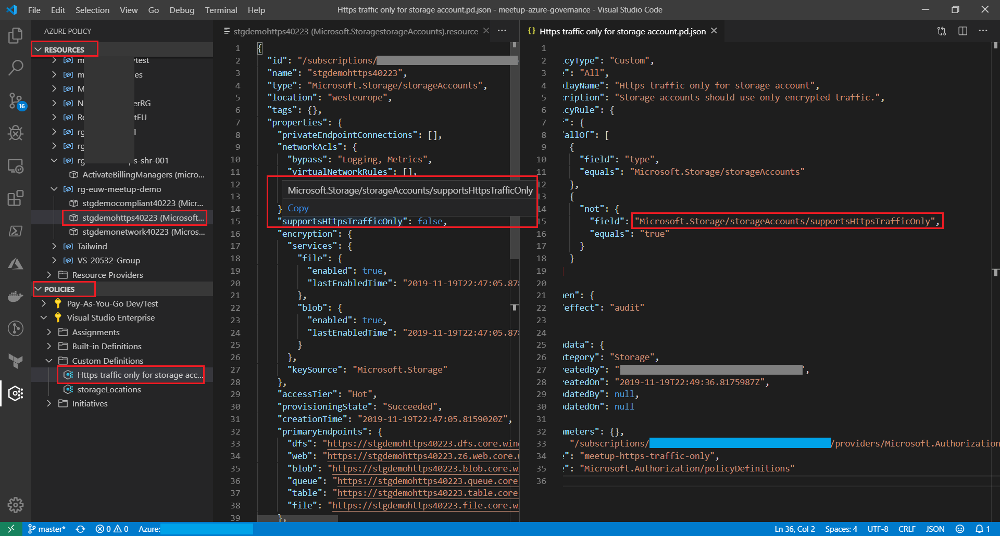

# VSCode Azure Policy Extension

Install the VSCode Extension 'Azure Policy'. Click on the Azure Policy extension icon in VSCode and take look at your resources
and your policies.

[Azure Policy](https://marketplace.visualstudio.com/items?itemName=AzurePolicy.azurepolicyextension). This extension is very helpful when maintaining or customizing policies.

Screenshot:  
